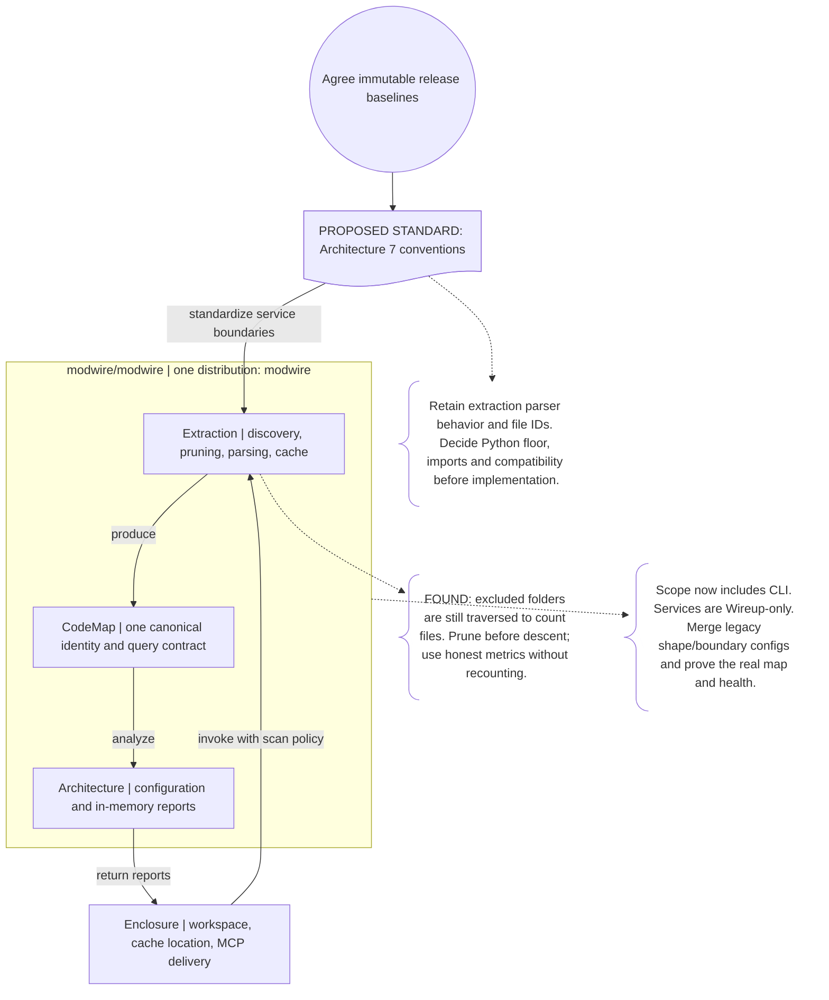

# 01 Proposed package standard and ownership

Enclosure diagram `pRWegQjSZXEvfwWEoCxZzq`, revision **19**. Planning proposal; see [current scope](README.md).

```mermaid
---
config:
  wrap: true
---
flowchart TD
e_v_standard@{ shape: doc, label: "PROPOSED STANDARD: Architecture 7 conventions" }
subgraph e_v_package["modwire/modwire | one distribution: modwire"]
  direction LR
  e_v_extraction@{ shape: rect, label: "Extraction | discovery, pruning, parsing, cache" }
  e_v_map@{ shape: rect, label: "CodeMap | one canonical identity and query contract" }
  e_v_architecture@{ shape: rect, label: "Architecture | configuration and in-memory reports" }
end
e_v_enclosure@{ shape: rect, label: "Enclosure | workspace, cache location, MCP delivery" }
e_v_baseline@{ shape: circle, label: "Agree immutable release baselines" }
e_v_standard r_v_standard_extraction@-->|"standardize service boundaries"| e_v_extraction
e_v_extraction r_v_extract_map@-->|"produce"| e_v_map
e_v_map r_v_map_report@-->|"analyze"| e_v_architecture
e_v_enclosure r_v_consumer_extract@-->|"invoke with scan policy"| e_v_extraction
e_v_architecture r_v_report_consumer@-->|"return reports"| e_v_enclosure
e_v_baseline r_v_baseline_standard@--> e_v_standard
a_v_retain@{ shape: comment, label: "Retain extraction parser behavior and file IDs. Decide Python floor, imports and compatibility before implementation." }
e_v_standard -.-> a_v_retain
a_v_finding@{ shape: comment, label: "FOUND: excluded folders are still traversed to count files. Prune before descent; use honest metrics without recounting." }
e_v_extraction -.-> a_v_finding
a_v_cli_wiring_config@{ shape: comment, label: "Scope now includes CLI. Services are Wireup-only. Merge legacy shape/boundary configs and prove the real map and health." }
e_v_package -.-> a_v_cli_wiring_config
```
