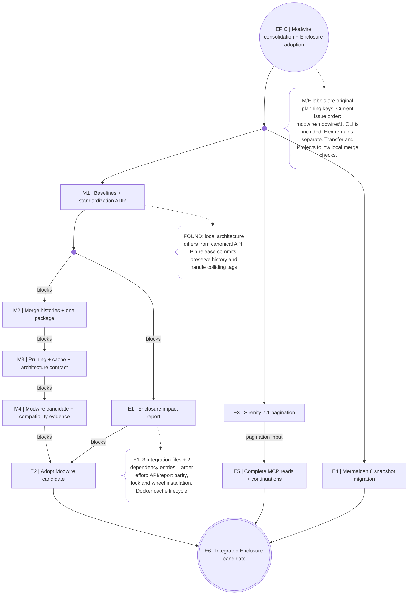

# 02 Coordinated epic and issue dependencies

Enclosure diagram `HUhdthFrEjBoLtZLtTrn4D`, revision **43**. Planning proposal; see [current scope](README.md).

```mermaid
---
config:
  wrap: true
---
flowchart TD
e_v_epic@{ shape: circle, label: "EPIC | Modwire consolidation + Enclosure adoption" }
e_v_m1@{ shape: rect, label: "M1 | Baselines + standardization ADR" }
e_v_m2@{ shape: rect, label: "M2 | Merge histories + one package" }
e_v_m3@{ shape: rect, label: "M3 | Pruning + cache + architecture contract" }
e_v_m4@{ shape: rect, label: "M4 | Modwire candidate + compatibility evidence" }
e_v_e1@{ shape: rect, label: "E1 | Enclosure impact report" }
e_v_e2@{ shape: rect, label: "E2 | Adopt Modwire candidate" }
e_v_e3@{ shape: rect, label: "E3 | Sirenity 7.1 pagination" }
e_v_e4@{ shape: rect, label: "E4 | Mermaiden 6 snapshot migration" }
e_v_e5@{ shape: rect, label: "E5 | Complete MCP reads + continuations" }
e_v_e6@{ shape: dbl-circ, label: "E6 | Integrated Enclosure candidate" }
e_v_workstreams@{ shape: f-circ, label: "Coordinated workstreams" }
e_v_contract_outputs@{ shape: f-circ, label: "Agreed contract" }
e_v_m2 r_v_m2_m3@-->|"blocks"| e_v_m3
e_v_m3 r_v_m3_m4@-->|"blocks"| e_v_m4
e_v_e1 r_v_e1_e2@-->|"blocks"| e_v_e2
e_v_m4 r_v_m4_e2@-->|"blocks"| e_v_e2
e_v_e3 r_v_e3_e5@-->|"pagination input"| e_v_e5
e_v_e2 r_v_e2_e6@--> e_v_e6
e_v_e4 r_v_e4_e6@--> e_v_e6
e_v_e5 r_v_e5_e6@--> e_v_e6
e_v_epic r_v_epic_workstreams@--> e_v_workstreams
e_v_workstreams r_v_epic_m1@--> e_v_m1
e_v_workstreams r_v_epic_e3@--> e_v_e3
e_v_workstreams r_v_epic_e4@--> e_v_e4
e_v_m1 r_v_m1_contract@--> e_v_contract_outputs
e_v_contract_outputs r_v_m1_m2@-->|"blocks"| e_v_m2
e_v_contract_outputs r_v_m1_e1@-->|"blocks"| e_v_e1
a_v_issue_links@{ shape: comment, label: "M/E labels are original planning keys. Current issue order: modwire/modwire#1. CLI is included; Hex remains separate. Transfer and Projects follow local merge checks." }
e_v_epic -.-> a_v_issue_links
a_v_impact@{ shape: comment, label: "E1: 3 integration files + 2 dependency entries. Larger effort: API/report parity, lock and wheel installation, Docker cache lifecycle." }
e_v_e1 -.-> a_v_impact
a_v_baselines@{ shape: comment, label: "FOUND: local architecture differs from canonical API. Pin release commits; preserve history and handle colliding tags." }
e_v_m1 -.-> a_v_baselines
```
