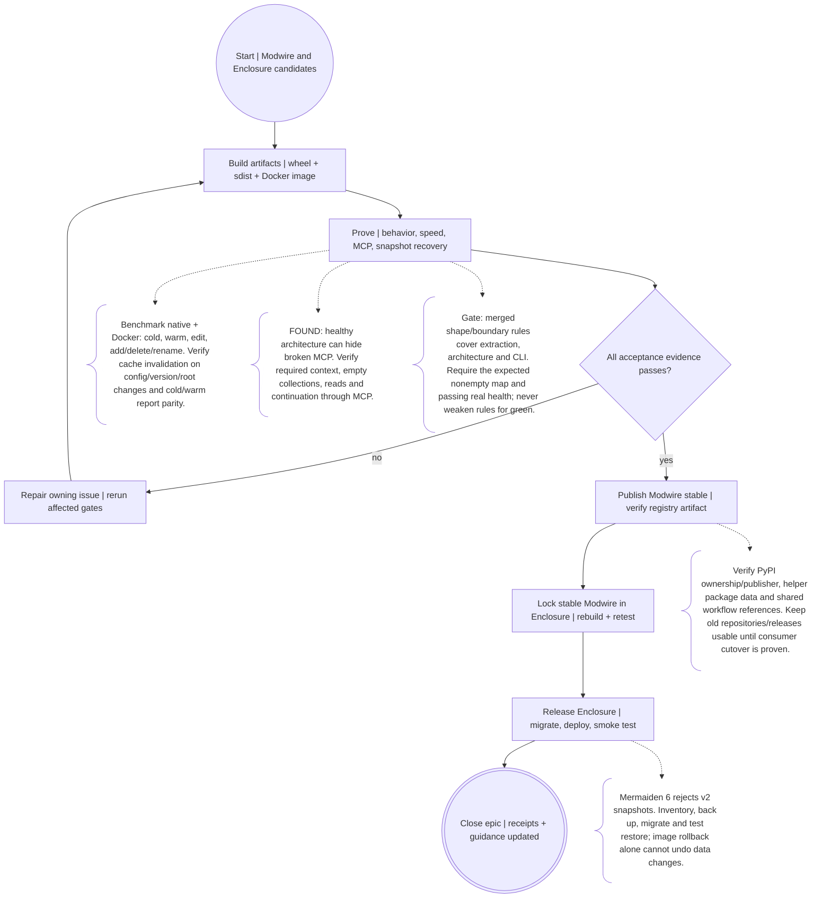

# 03 Release train and evidence gates

Enclosure diagram `PBLeM6dFuqQrawEuKFUGG9`, revision **24**. Planning proposal; see [current scope](README.md).

```mermaid
---
config:
  wrap: true
---
flowchart TD
e_v_ready@{ shape: circle, label: "Start | Modwire and Enclosure candidates" }
e_v_build@{ shape: rect, label: "Build artifacts | wheel + sdist + Docker image" }
e_v_prove@{ shape: rect, label: "Prove | behavior, speed, MCP, snapshot recovery" }
e_v_gate@{ shape: diam, label: "All acceptance evidence passes?" }
e_v_repair@{ shape: rect, label: "Repair owning issue | rerun affected gates" }
e_v_publish@{ shape: rect, label: "Publish Modwire stable | verify registry artifact" }
e_v_lock@{ shape: rect, label: "Lock stable Modwire in Enclosure | rebuild + retest" }
e_v_deploy@{ shape: rect, label: "Release Enclosure | migrate, deploy, smoke test" }
e_v_close@{ shape: dbl-circ, label: "Close epic | receipts + guidance updated" }
e_v_ready r_v_r_build@--> e_v_build
e_v_build r_v_b_prove@--> e_v_prove
e_v_prove r_v_p_gate@--> e_v_gate
e_v_gate r_v_failed@-->|"no"| e_v_repair
e_v_repair r_v_retry@--> e_v_build
e_v_gate r_v_passed@-->|"yes"| e_v_publish
e_v_publish r_v_pub_lock@--> e_v_lock
e_v_lock r_v_lock_deploy@--> e_v_deploy
e_v_deploy r_v_deploy_close@--> e_v_close
a_v_correctness@{ shape: comment, label: "Benchmark native + Docker: cold, warm, edit, add/delete/rename. Verify cache invalidation on config/version/root changes and cold/warm report parity." }
e_v_prove -.-> a_v_correctness
a_v_mcp_gate@{ shape: comment, label: "FOUND: healthy architecture can hide broken MCP. Verify required context, empty collections, reads and continuation through MCP." }
e_v_prove -.-> a_v_mcp_gate
a_v_snapshot_gate@{ shape: comment, label: "Mermaiden 6 rejects v2 snapshots. Inventory, back up, migrate and test restore; image rollback alone cannot undo data changes." }
e_v_deploy -.-> a_v_snapshot_gate
a_v_publication@{ shape: comment, label: "Verify PyPI ownership/publisher, helper package data and shared workflow references. Keep old repositories/releases usable until consumer cutover is proven." }
e_v_publish -.-> a_v_publication
a_v_health_coverage@{ shape: comment, label: "Gate: merged shape/boundary rules cover extraction, architecture and CLI. Require the expected nonempty map and passing real health; never weaken rules for green." }
e_v_prove -.-> a_v_health_coverage
```
